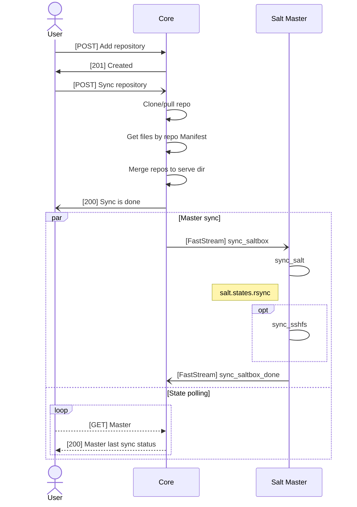

# Descriptions for common flows

## SLS repository syncing

The sequence is actual for Jul 2025.



The weak side is missing notification on full replication end: user should check last synchronization status of master of interest.

## Master auth lifecycle

The sequence is actual for Jul 2025.

```mermaid
sequenceDiagram
  actor User
  participant Core
  participant Master as Salt Master

  Note over Core,Master: FastStream bus

  loop
    Master ->> Core: [BridgeAuthRequest] Authorize!
    Core ->> Master: [CoreAuthResponse] Unaccepted
  end

  Note over User,Core: HTTP

  User ->> Core: [POST] Accept the Master
  Core ->> User: [200] OK

  Master ->> Core: [BridgeAuthRequest] Authorize!
  Core ->>+ Master: [CoreAuthResponse] Accepted
  Note left of Master: Normal sync with salt.states.rsync
  Master -) Master: Sync Salt.Box
  Master ->> Core: [BridgeSyncDoneMessage] Sync status

  User --> Core: [POST] Unaccept the Master
  deactivate Master
  Core --> User: [200] OK
  ```